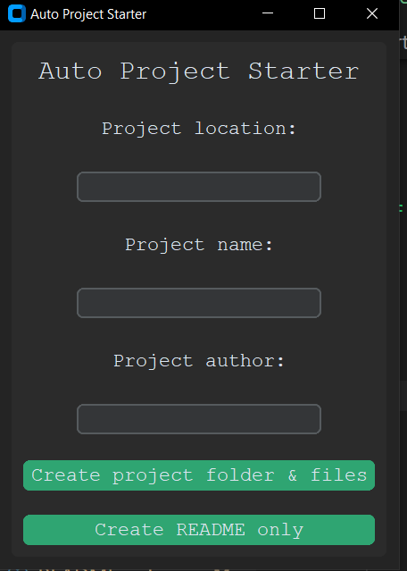

## About

A python script which automates the manual steps usually taken to setup a python project. It generates a project folder, README, TODO and main.py with the appropriate details. The template files are included in the project to allow for easy modification to satisfy more specific use cases.

This script now includes a GUI.

## Table of Contents

- [Local Setup](#local-setup)
- [Status](#Status)
- [License](#license)

## Local Setup

Clone or Download the repository from Github

Install dependencies

`pip install -r requirements.txt`

Run the python script

`python auto_starter_gui.py`

## Status

Completed.

In the future I hope to add a Command-Line Interface and additional templates such as a Django project template.

## License

This project is licensed under the terms of the MIT license.

You can find the License for this project [here](LICENSE.md)